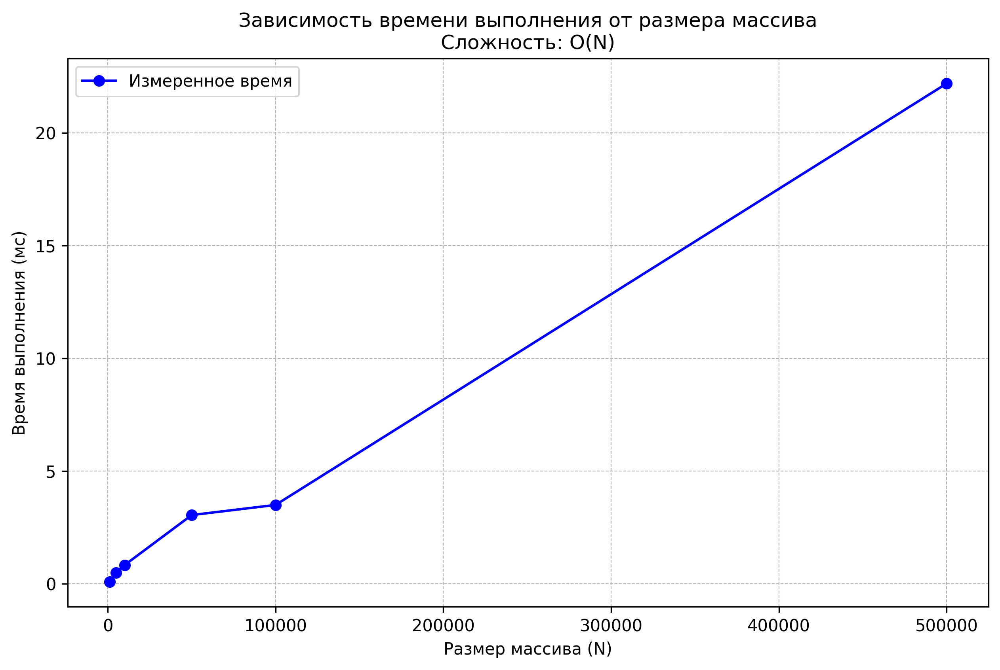

# Лабораторная работа 00

**Тема:** Решение алгоритмических задач. Введение в инструменты и критерии оценки  

---

## Цель работы
- Настроить рабочее окружение для разработки на Python.  
- Освоить базовые операции ввода/вывода.  
- Написать и протестировать первую программу.  
- Научиться оценивать сложность операций и алгоритмов.  
- Провести эмпирические замеры времени выполнения и визуализировать результаты.  

---

## Теоретическая часть

**Алгоритм** — последовательность шагов для решения задачи.  
**Структуры данных** — способы организации данных для эффективной работы.  
**Оценка решения**:  
- *Правильность работы* (корректный результат).  
- *Эффективность* (скорость выполнения и использование памяти).  

**Сложность алгоритма** измеряется количеством операций от размера входных данных `N`.  
Для описания используется **O-нотация**.  

## Эксперименты

**Характеристики ПК для тестирования (пример):**
- Процессор: Intel Core i5-10210U @ 1.60GHz
- Оперативная память: 16 GB DDR4
- ОС: Windows 10
- Python: 3.13.2

**Наборы данных:**  
`N = [1000, 5000, 10000, 50000, 100000, 500000]`

**Результаты замеров (пример):**

Размер (N)   Время (мс)   Время/N (мкс)
   1000        0.0830          0.0830
   5000        0.4914          0.0983
   10000       0.8286          0.0829
   50000       3.0472          0.0609
   100000      3.4959          0.0350
   500000      22.1906         0.0444

### График

---

## Анализ результатов
1. Теоретическая сложность алгоритма суммирования массива: **O(N)**. 
2. Локальные замедления — это особенности работы системы и Python, а не самого алгоритма. 
3. Практические замеры подтверждают линейную зависимость времени выполнения от `N`.  
4. Время на один элемент остаётся примерно постоянным.  
5. Программа корректно обрабатывает большие наборы данных.  

---

## Выводы
- Освоены базовые операции ввода/вывода в Python.  
- Получены первые оценки сложности алгоритмов.  
- Проведён анализ теоретической и эмпирической сложности.  
- Построен график зависимости времени выполнения от размера массива. 
