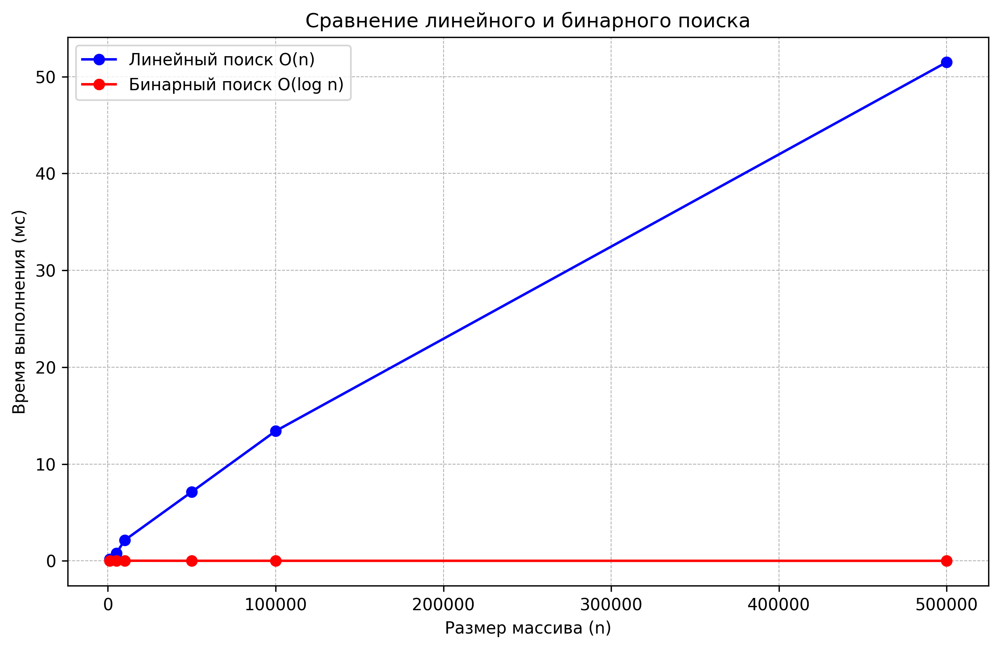
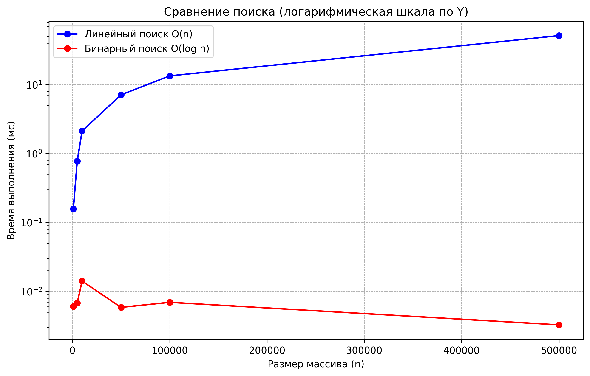

# Отчет по лабораторной работе 01
# Введение в алгоритмы. Сложность. Поиск

**Дата:** 2025-10-07 

**Семестр:** 3 курс 2 полугодие - 6 семестр

**Группа:** ПИЖ-б-о-23-1

**Дисциплина:** Анализ сложности алгоритмов

**Студент:** Романов Александр Сергеевич

## Цель работы
Освоить понятие вычислительной сложности алгоритмов.  
Получить практические навыки реализации и анализа линейного и бинарного поиска.  
Научиться экспериментально подтверждать теоретические оценки сложности **O(n)** и **O(log n)**.

---

## Теоритическая часть

- **Сложность алгоритма** - Характеризует количество ресурсов (времени и памяти), необходимых
 алгоритму для обработки входных данных объема n
- **Асимптотический анализ:** - Анализ поведения алгоритма при стремлении n к бесконечности.
 Позволяет абстрагироваться от констант и аппаратных особенностей.
- **O-нотация («О-большое»)** - Верхняя асимптотическая оценка роста функции. Определяет
 наихудший сценарий работы алгоритма.
- **Линейный поиск (Linear Search)** - Последовательный перебор всех элементов массива. Сложность: O(n)
- **Бинарный поиск (Binary Search)** -Поиск в отсортированном массиве путем многократного
 деления интервала поиска пополам. Сложность: O(log n). Требует предварительной сортировки
 (O(n log n)).

### Линейный поиск
- Перебор элементов массива последовательно.  
- В худшем случае проверяет все `n` элементов.  
- Сложность: **O(n)**.  

### Бинарный поиск
- Работает только на отсортированном массиве.  
- На каждом шаге делит интервал поиска пополам.  
- Количество шагов пропорционально `log₂(n)`.  
- Сложность: **O(log n)**.  
- Дополнительно: сортировка массива перед поиском имеет сложность **O(n log n)**.

---

## Практическая часть

### Задание
1. Реализовать функции:
   - `linear_search(arr, target)`  
   - `binary_search(arr, target)`  
2. Добавить комментарии с оценкой сложности каждой строки.  
3. Провести замеры времени выполнения для разных размеров массива.  
4. Построить графики зависимости времени от размера массива.  
5. Сравнить теоретическую и практическую сложность.  

### Подготовка данных
- Сгенерированы отсортированные массивы: `[1000, 5000, 10000, 50000, 100000, 500000]`.  
- Для поиска выбран элемент: **последний** (худший случай).  

### Характеристики ПК
- Процессор: Intel Core i5-10210U @ 1.60GHz
- Оперативная память: 16 GB DDR4
- ОС: Windows 10
- Python: 3.13.2

---

## Результаты замеров

Таблица (время в миллисекундах, усреднение по 10 запускам):

| Размер (n) | Линейный (мс) | Бинарный (мс) |
|------------|----------------|----------------|
| 1 000      | 0.1570         | 0.0025         |
| 5 000      | 0.7784         | 0.0033         |
| 10 000     | 2.1294         | 0.0035         |
| 50 000     | 7.1257         | 0.0059         |
| 100 000    | 13.4058        | 0.0069         |
| 500 000    | 51.4864        | 0.0103         |

## Графики

### 1. В линейном масштабе

### 2. В логарифмическом масштабе

---

## Анализ результатов

1. Теоретически:
   - Линейный поиск: **O(n)**.  
   - Бинарный поиск: **O(log n)**.  
2. Эксперименты подтвердили:
   - Время линейного поиска растёт **пропорционально n**.  
   - Время бинарного поиска растёт очень медленно  
3. Разница особенно заметна на больших массивах: бинарный поиск работает в сотни раз быстрее.  

---

## Выводы
- Реализованы линейный и бинарный поиск.  
- Погрешности в замерах обусловлены многозадачностью ОС, кэшированием, работой интерпретатора Python и случайными колебаниями времени на микросекундных интервалах. Для больших массивов они не влияют на общий тренд: линейный поиск растёт пропорционально N, бинарный почти не изменяется.
- Полученные замеры подтверждают теоретическую асимптотику.  
- Бинарный поиск значительно эффективнее при больших входных данных.  
- Работа показала важность выбора алгоритма: асимптотическая разница даёт колоссальный выигрыш на практике.  

## Контрольные вопросы

### 1. Что такое асимптотическая сложность алгоритма и зачем она нужна?

Асимптотическая сложность алгоритма — это характеристика, показывающая, как изменяется время выполнения или потребление памяти алгоритмом в зависимости от размера входных данных.  
Она нужна для:

- Сравнения алгоритмов независимо от конкретного компьютера.
- Прогнозирования производительности на больших объёмах данных.
- Выбора оптимального алгоритма для решения задачи.

Пример: если алгоритм требует `O(n)` операций, это значит, что при удвоении размера входных данных время работы приблизительно удвоится.

---

### 2. Разница между O(1), O(n) и O(log n)

- **O(1)** — константная сложность: время выполнения не зависит от размера данных.  
  **Пример:** получение элемента массива по индексу `arr[i]`.

- **O(n)** — линейная сложность: время выполнения растет пропорционально размеру данных.  
  **Пример:** линейный поиск элемента в массиве.

- **O(log n)** — логарифмическая сложность: время выполнения растет очень медленно по мере увеличения данных.  
  **Пример:** бинарный поиск в отсортированном массиве.

---

### 3. Основное отличие линейного поиска от бинарного

- **Линейный поиск** проверяет каждый элемент последовательно. Не требует предварительной сортировки данных.  
- **Бинарный поиск** делит массив пополам на каждом шаге и сравнивает с целевым элементом. Для работы требует **отсортированный массив**.

**Предварительные условия для бинарного поиска:**
1. Массив должен быть отсортирован.
2. Доступ к элементам массива должен быть за O(1) (например, массив, а не связанный список).

---

### 4. Почему на практике время выполнения может отличаться от теоретической оценки O?

- Зависимость от конкретного компьютера (процессор, оперативная память, кэш).  
- Оптимизация компилятора или интерпретатора.  
- Задержки из-за системы ввода/вывода.  
- Разные константы и накладные расходы, не учитываемые в теории.  

> Теоретическая оценка описывает **асимптотику**, а не точное время выполнения.

---

### 5. Как экспериментально подтвердить сложность алгоритма?

**План эксперимента:**
1. Подготовить наборы данных разного размера `n`.
2. Запустить алгоритм на каждом наборе и измерить время выполнения.
3. Построить график зависимости времени от размера данных.
4. Сравнить график с теоретической сложностью:
   - O(n) — линейный рост времени.
   - O(log n) — медленный рост, напоминающий логарифмическую кривую.
5. Сделать выводы о соответствии экспериментальных данных теории.