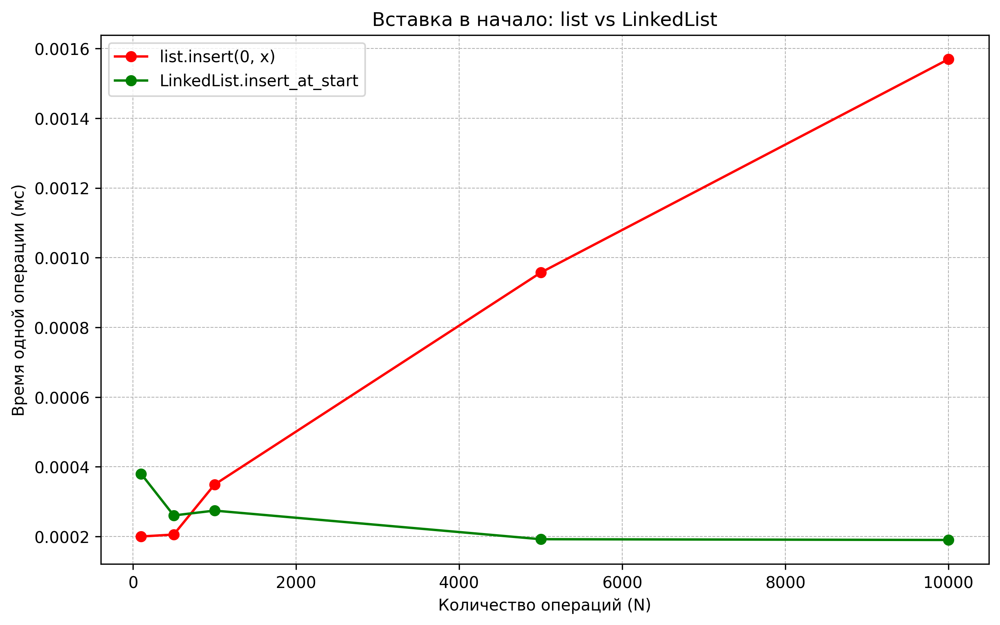
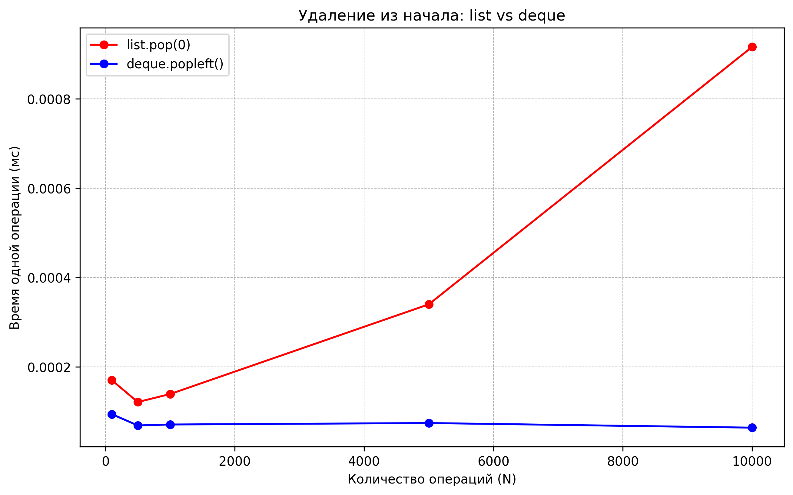

# Отчет по лабораторной работе 02
# Основные структуры данных. Анализ и применение 

**Дата:** 2025-10-07 

**Семестр:** 3 курс 2 полугодие - 6 семестр

**Группа:** ПИЖ-б-о-23-1

**Дисциплина:** Анализ сложности алгоритмов

**Студент:** Романов Александр Сергеевич

## Цель работы
Изучить понятие и особенности базовых абстрактных типов данных (стек, очередь, дек,
связный список) и их реализаций в Python. Научиться выбирать оптимальную структуру данных для
решения конкретной задачи, основываясь на анализе теоретической и практической сложности
операций. Получить навыки измерения производительности и применения структур данных для
решения практических задач

---

## Теоритическая часть

- **Список (list)** — Реализация динамического массива.  
  Обеспечивает амортизированное время **O(1)** для добавления в конец (`append`).  
  Вставка и удаление в середину имеют сложность **O(n)** из-за сдвига элементов.  
  Доступ по индексу — **O(1)**.

- **Связный список (Linked List)** — Абстрактная структура данных, состоящая из узлов, где каждый узел содержит данные и ссылку на следующий элемент.  
  Вставка и удаление в известное место (например, начало списка) выполняются за **O(1)**.  
  Доступ по индексу и поиск — **O(n)**.

- **Стек (Stack)** — Абстрактный тип данных, работающий по принципу LIFO (*Last-In-First-Out*).  
  Основные операции: `push` (добавление, **O(1)**), `pop` (удаление с вершины, **O(1)**), `peek` (просмотр вершины, **O(1)**).  
  В Python может быть реализован на основе списка (`list`).

- **Очередь (Queue)** — Абстрактный тип данных, работающий по принципу FIFO (*First-In-First-Out*).  
  Основные операции: `enqueue` (добавление в конец, **O(1)**), `dequeue` (удаление из начала, **O(1)**).  
  В Python для эффективной реализации используется `collections.deque`.

- **Дек (Deque, двусторонняя очередь)** — Абстрактный тип данных, позволяющий добавлять и удалять элементы как в начало, так и в конец.  
  Все основные операции — **O(1)**.  
  В Python реализован в классе `collections.deque`.

---

## Практическая часть

### Задание

 1. Реализовать класс LinkedList (связный список) для демонстрации принципов его работы.
 2. Используя встроенные типы данных (list, collections.deque), проанализировать
 эффективность операций, имитирующих поведение стека, очереди и дека.
 3. Провести сравнительный анализ производительности операций для разных структур данных
 (list vs LinkedList для вставки, list vs deque для очереди).
 4. Решить 2-3 практические задачи, выбрав оптимальную структуру данных

## Реализованные методы
### `linked_list.py`
- `insert_at_start(data)` — O(1)
- `insert_at_end(data)` — O(1) 
- `delete_from_start()` — O(1)
- `traversal()` — O(n)

### `task_solutions.py`
- `is_balanced_brackets` — O(n)
- `print_queue_simulation` (использует `deque`) — O(n)
- `is_palindrome` (использует `deque`) — O(n)

## Характеристики ПК
- Процессор: Intel Core i5-10210U @ 1.60GHz
- Оперативная память: 16 GB DDR4
- ОС: Windows 10
- Python: 3.13.2

---

## Графики

### 1. Вставка в начало (list.insert(0) vs LinkedList.insert_at_start)

На графике видно, что `LinkedList.insert_at_start` даёт почти постоянное время (O(1)),  
а `list.insert(0)` растёт примерно линейно (O(n)).

---

### 2. Удаление из начала (list.pop(0) vs deque.popleft())

`deque.popleft()` остаётся практически константой (O(1)),  
а `list.pop(0)` растёт линейно (O(n)).

---

## Общие выводы
- Экспериментально подтверждена асимптотика:  
  `LinkedList.insert_at_start` и `deque.popleft()` — O(1);  
  `list.insert(0)` и `list.pop(0)` — O(n).
- Для операций у начала структуры данных выгоднее использовать `LinkedList` или `deque`.
- Python-список эффективен как динамический массив (доступ по индексу, добавление в конец), но неэффективен для частых операций у начала.
- Падение линии «время/операция» в начале при увеличении  числа операций — типичный артефакт из-за постоянной накладной части измерителя; это не обязательно ошибка алгоритма.

## Контрольные вопросы

### 1. В чем ключевое отличие динамического массива (list в Python) от связного списка с точки зрения сложности операций вставки в начало и доступа по индексу?

- **Доступ по индексу:**
  - **Динамический массив (list):** O(1) — прямой доступ к элементу.
  - **Связный список:** O(n) — нужно пройти по узлам от начала.
- **Вставка в начало:**
  - **Динамический массив:** O(n) — сдвиг всех элементов.
  - **Связный список:** O(1) — изменение указателей первого узла.

---

### 2. Объясните принцип работы стека (LIFO) и очереди (FIFO). Приведите по два примера их практического использования.

- **Стек (LIFO — Last In, First Out):**
  - Последний добавленный элемент извлекается первым.
  - **Примеры:**
    1. Реализация функции `undo` в текстовых редакторах.
    2. Обход дерева или графа в глубину (DFS).

- **Очередь (FIFO — First In, First Out):**
  - Первый добавленный элемент извлекается первым.
  - **Примеры:**
    1. Очередь задач в многозадачной системе.
    2. Буфер сообщений в сетевых приложениях.

---

### 3. Почему операция удаления первого элемента из списка (list) в Python имеет сложность O(n), а из дека (deque) — O(1)?

- **list:** Удаление первого элемента требует сдвига всех остальных элементов — O(n).
- **deque:** Реализован как двусвязный список или кольцевой буфер, поэтому удаление первого элемента происходит за O(1) без сдвига остальных элементов.

---

### 4. Какую структуру данных вы бы выбрали для реализации системы отмены действий (undo) в текстовом редакторе? Обоснуйте свой выбор.

- **Выбор:** стек (LIFO)  
- **Обоснование:** Последнее выполненное действие должно быть первым, которое можно отменить. Стек идеально подходит под принцип LIFO — последнее добавленное действие извлекается первым.

---

### 5. Замеры показали, что вставка 1000 элементов в начало списка заняла значительно больше времени, чем вставка в начало вашей реализации связного списка. Объясните результаты с точки зрения асимптотической сложности.

- **list:** Вставка в начало требует сдвига всех элементов — O(n) для каждой вставки, 1000 вставок ≈ O(n·1000).
- **Связный список:** Вставка в начало через изменение указателей — O(1) для каждой вставки, 1000 вставок ≈ O(1000).

**Вывод:** Динамический массив медленнее при вставке в начало из-за необходимости сдвига элементов, связный список выполняет это быстро благодаря изменению указателей.

